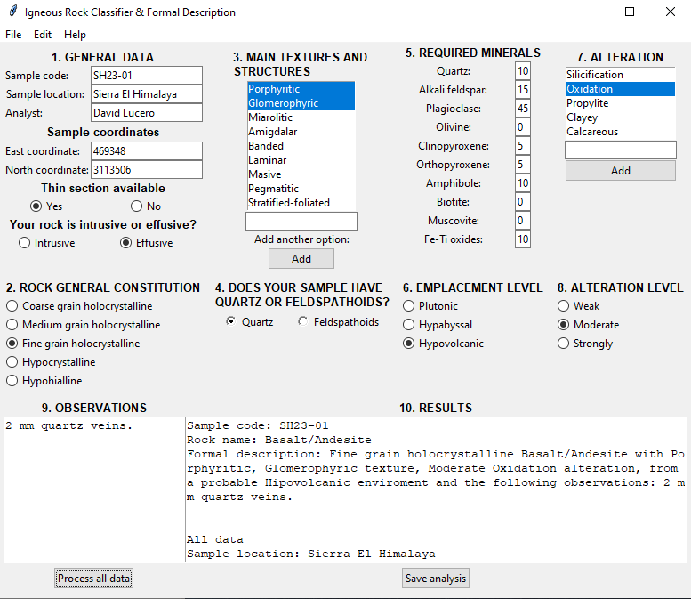
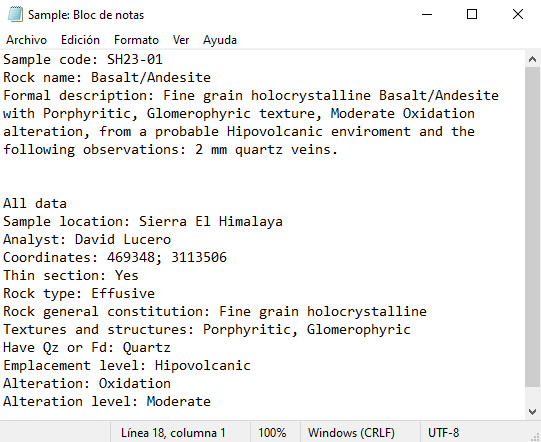

# IRC_and_FD
Igneous Rock Classifier and Formal Description: sofware for academic and research purposes.

A Python-based tool for classifying igneous rocks using the QAPF system and generating formal petrographic descriptions. Designed for both hand sample and thin section input, this software supports students, researchers, and professionals in the field of geology.

---

## 🧭 Purpose of the Software

This software is designed to classify igneous rocks using the QAPF classification system and generate a formal description of each sample, relying solely on hand specimens or thin sections.

---

## 🎯 Main Objective

To simplify the classification of intrusive, extrusive, and pyroclastic rocks.

---

## 📌 Secondary Objectives

- Provide instant and clear visualization of classification results.  
- Enable the export of data for use outside the software environment.

---

## ⚙️ Key Features

- Automatic rock classification  
- Normalization of mineral percentages  
- Generation of detailed reports for each classified rock

---

## 🔄 Workflow

1. The user enters general and specific data for the sample.  
2. The level of accuracy depends on the available data:
   - Hand sample only  
   - Thin section analysis  
3. The software processes the input automatically—no calculations are required by the user.  
4. The results are delivered as text: the output includes the rock classification and a formal petrographic description.

---

## 💻 Technical Details

**Programming Language:** Python  
This tool is currently under development using Python and built-in libraries (e.g., Tkinter for the graphical interface).

---

## 🧪 Expected Outcomes

- **For research use:** Enables rapid data processing and supports interpretation workflows.
- **For educational use:** Acts as a learning tool to guide students through the theoretical foundations of rock classification.

The software aims to contribute to the field of geology-focused tools by offering formal classification support for pyroclastic rocks—a category less commonly addressed compared to intrusive and extrusive rocks.

---

## 📈 Future Improvements

Plans include the implementation of a rock image library featuring corresponding hand samples, thin sections, and, when possible, geochemical data. Each entry would be pre-classified and formally described, allowing users to compare their samples with reference examples.

## Screenshots

### Main interface

### Product

---
## ⚠️ License Notice

This software is licensed for **personal and non-commercial use only**.  
Public presentation (e.g., conferences, classes, publications) and commercial use are **not allowed without written permission**.  
Attribution to the author is required at all times.

© 2025 David Absalón Lucero Acosta. All rights reserved.
